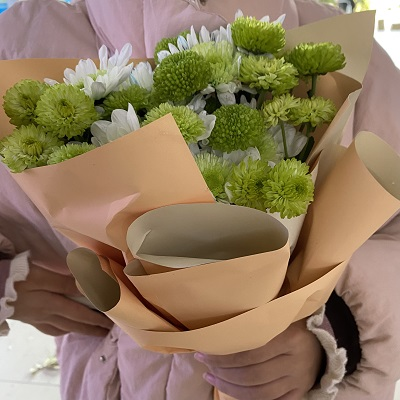

<iframe frameborder="no" border="0" marginwidth="0" marginheight="0" width=330 height=86 src="//music.163.com/outchain/player?type=2&id=1826189041&auto=1&height=66"></iframe>

## 买到fafa啦

今天好冷哦，风真的好大，终于到了北京的冬天了。

下午一起出去，到银行去充燃气咯。虽然是白跑了一趟，哈哈，但是还是收获了一些其他的东西。

比如：

1. 收获了一顿曾经在花小猪经常吃的那个美食广场的饭；（哈哈哈，说实话我在前面骑车子，你在后面追，真的好可怜哦嘿嘿嘿）；

2. 收获了一束fafa，你说说你，为啥要买这么丑的一束花！该花钱的时候你就舍不得了真是的！

（是真的丑呢，未免也太绿了！）

3. 收获了回家的偶遇的买菜小哥的热情推销，使宝贝获得了许多的水果吃。（光想着买的时候的快乐了，忽略了还得我自己洗水果的事实呜呜，不过怎么说也不能让宝贝洗对吧哈哈）

今天真的好冷哦，我都不想走，可是还得走呀，明天还得上班。

💕💕💕下周就见啦，离别是为了更好的相遇嘻嘻！