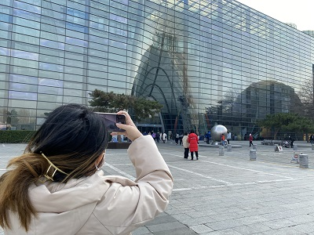
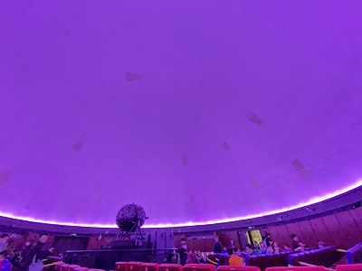
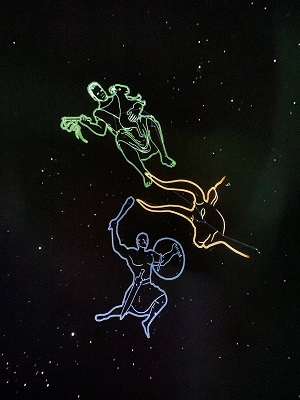
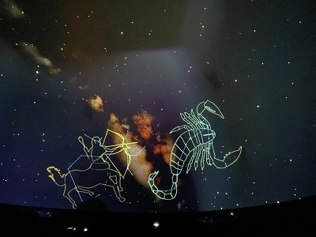
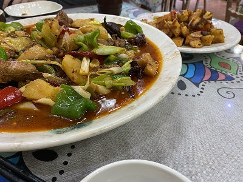

<iframe frameborder="no" border="0" marginwidth="0" marginheight="0" width=330 height=86 src="//music.163.com/outchain/player?type=2&id=30089063&auto=1&height=66"></iframe>

## 大白天看星星啦

首先要感谢宝贝啦~ 提前给我过生日，还买了票去天文馆~~

哈哈，当然还得给你道歉，一直说带你去天文馆，结果还是你先带我去了。

不过好累哦，去之前还帮你收拾了房间布局，我倒是觉着比以前宽敞了一些些，嘿嘿。

终于饿着肚子到了天文馆啦~

你看看你，就知道先拍照，终于进城了就这个样子嘛哈哈哈！（然后我也拍了一张）

里面还挺不错的，我们也是紧赶慢赶赶上了剧场，里面还是挺大的呢。

这个360度环形巨幕真好看！

还介绍了不同的星座，哈哈哈，我们好像两个小孩子来听科普呢。

半小时就看完咯，星空真好看！

我们逛了一会儿，还去做了游戏，哈哈哈，你说说你，赢了两个小孩子，你还洋洋得意，“他们都没我们分高！”哈哈哈，我真怕小朋友当场哭出来。

逛完啦，去吃饭，走了好久走到了你心心念念的大盘鸡餐馆。

看着针不戳，而且还挺有新疆特色的（我在说什么屁话哈哈），果然新疆驻京办旁边的挺正宗。

开开心心的一天呢~

🎂